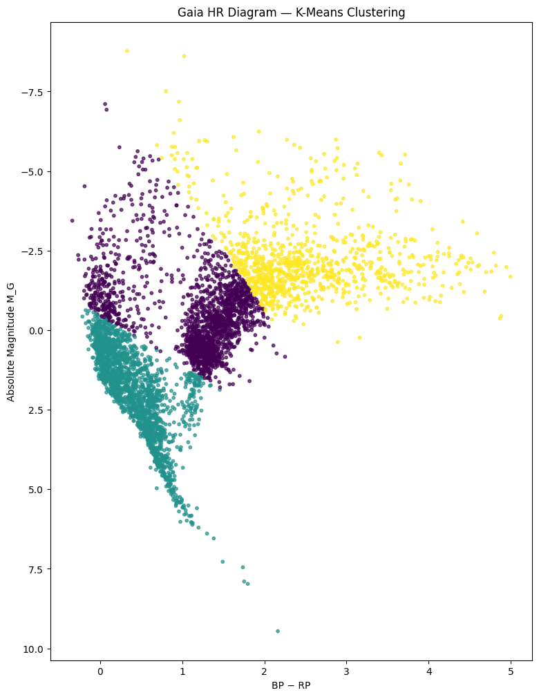
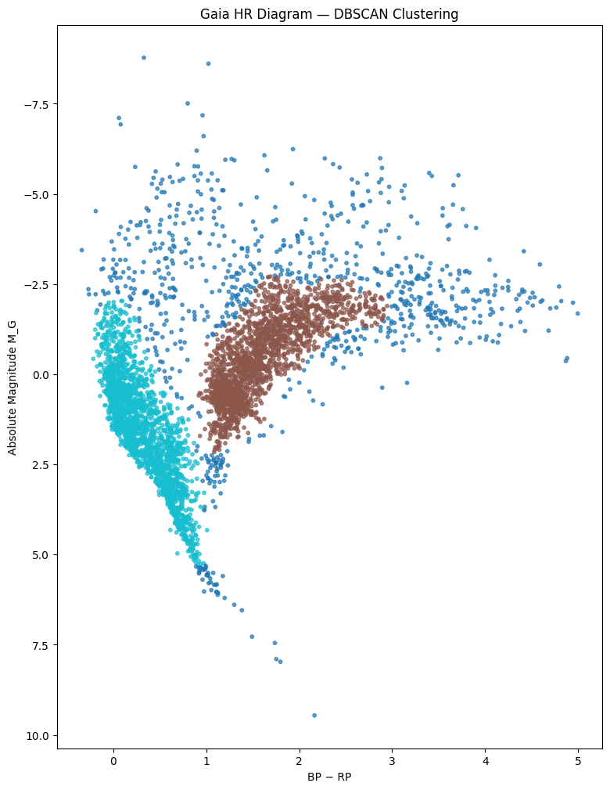
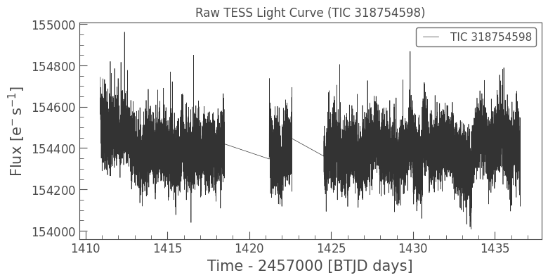
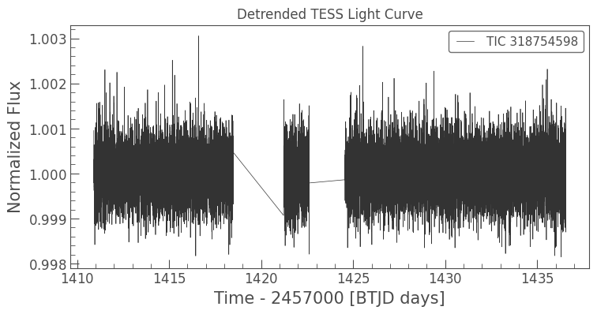
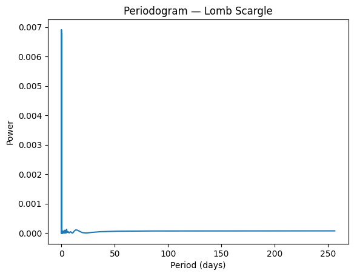
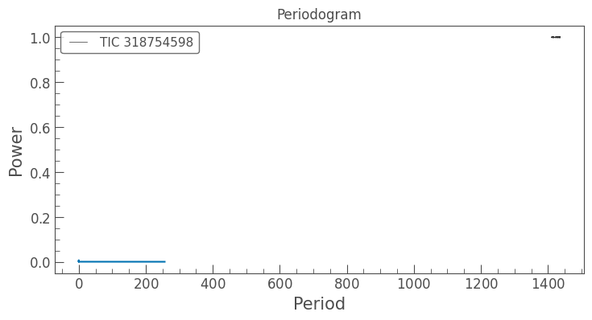
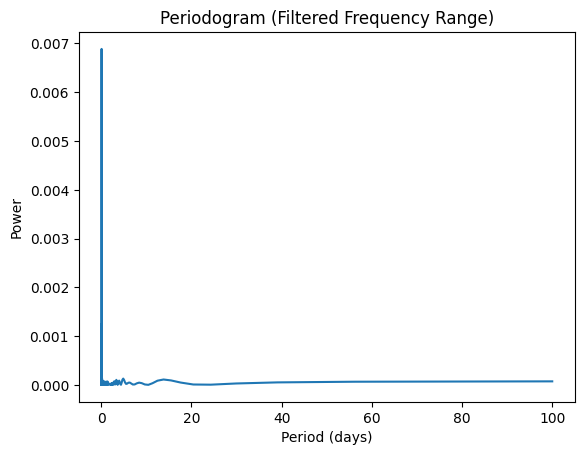
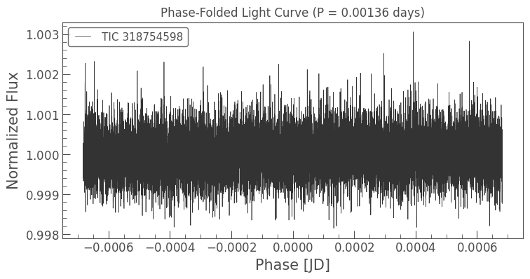
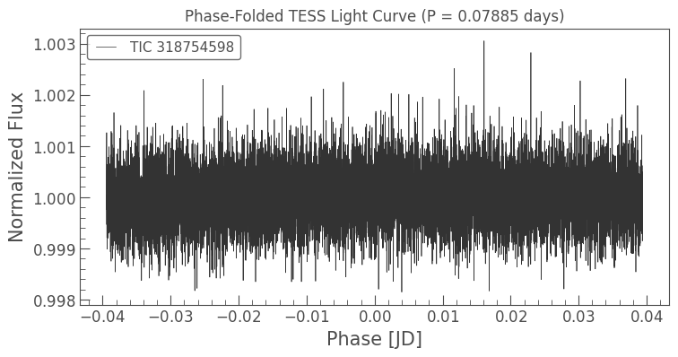

#  Gaia Stellar Analyzer

A complete mini–pipeline for exploring stellar populations using **Gaia photometry** and analyzing stellar variability with **TESS light curves**.  
The project includes HR diagram construction, clustering methods, period detection, and phase-folded light curve visualization.

# Gaia HR Diagram Analysis

##  K-Means Clustering
Identifies major stellar groups (main sequence, red giants, etc.) in BP–RP vs. absolute magnitude space.

##  DBSCAN Clustering
Density-based clustering reveals dense stellar groups while naturally ignoring outliers.

#  TESS Light Curve Analysis

##  Raw TESS Light Curve
Unprocessed brightness variations from TESS.

## Detrended TESS Light Curve
Removes long-term trends and prepares the data for period analysis.

# Period Search

##  Lomb–Scargle Periodogram
Primary period detection over a standard frequency range.

## Wide-Range Periodogram
Explores long periods (0–1500 days), useful when searching for slow variability.

## Filtered (Short-Period) Periodogram
Focuses on short periods (0–100 days) to identify fast variability.

#  Phase-Folded Light Curves

##  Phase-Folded Light Curve (P = 0.00136 days)
Displays periodic modulation using the strongest short-period peak.

##  Phase-Folded Light Curve (P = 0.07885 days)
An additional candidate period revealed in the wide-range search.

#  Summary

This project demonstrates:
- How to build HR diagrams from Gaia DR3
- How to classify stars using unsupervised ML (K-Means, DBSCAN)
- How to extract and clean TESS light curves
- How to detect stellar variability using Lomb–Scargle periodograms
- How to visualize periodicity through phase-folded light curves

It serves as a compact, reproducible stellar-analysis pipeline suitable for learning, exploration, and future scientific development.

